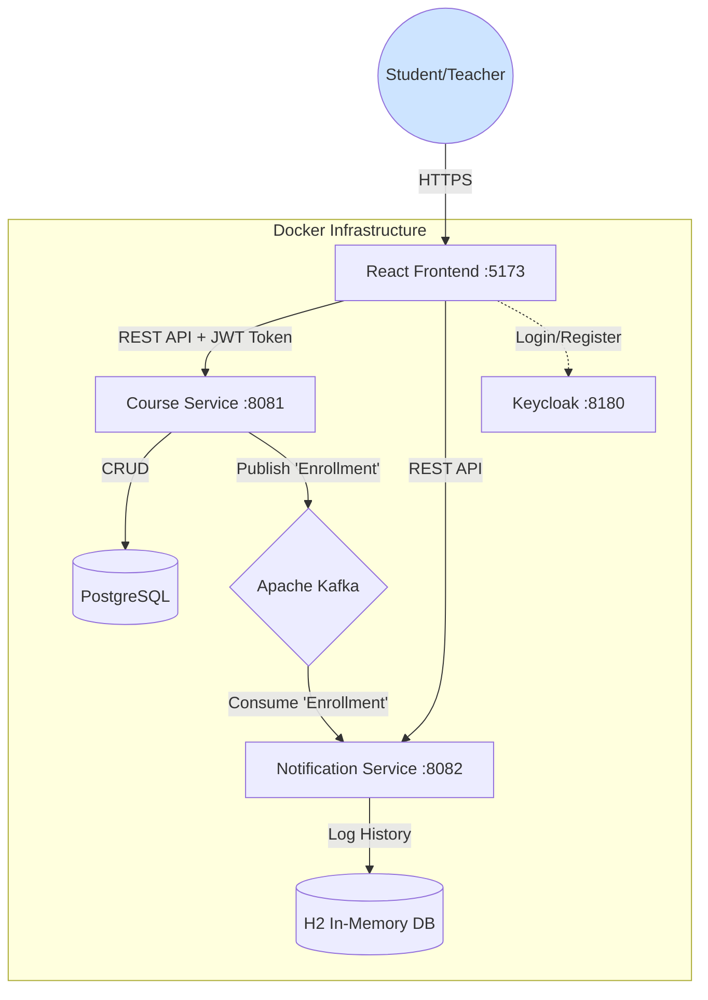

# 🎓 Education Platform - Микросервисный проект

Платформа для онлайн-обучения, построенная на микросервисной архитектуре с использованием Spring Boot, Kafka и React. Проект демонстрирует принципы асинхронного взаимодействия, разделения ответственности и централизованной аутентификации с помощью Keycloak.


---

### Оглавление
1.  [Архитектура системы](#-архитектура-системы)
2.  [Ключевые возможности](#-ключевые-возможности)
3.  [Технологический стек](#-технологический-стек)
4.  [Как запустить проект](#-как-запустить-проект)
5.  [Доступ к сервисам](#-доступ-к-сервисам)
6.  [Структура проекта](#-структура-проекта)

---

### 🏛️ Архитектура системы

Система построена по принципу разделения ответственности. Каждый сервис выполняет свою уникальную бизнес-задачу и может быть развернут независимо.

*   **Course Service**: "Мозг" системы. Управляет курсами, пользователями, балансом и покупками.
*   **Notification Service**: Фоновый сервис, который слушает события из Kafka и логирует уведомления.
*   **Kafka**: "Нервная система". Обеспечивает асинхронную и надежную связь между сервисами.

Интерактивная версия этой диаграммы доступна на **вкладке "Документация"** внутри самого веб-приложения.



---

### ✨ Ключевые возможности

*   **Аутентификация и Регистрация:** Полная интеграция с Keycloak для безопасного входа и создания новых пользователей.
*   **Управление ролями:** Четкое разделение прав между **Студентами** (могут покупать курсы) и **Преподавателями** (могут создавать и управлять курсами).
*   **Каталог курсов:** Просмотр, создание, редактирование и удаление курсов.
*   **Биллинг:** У каждого пользователя есть личный баланс, который можно пополнять и с которого списываются средства при покупке.
*   **Подписка и отписка:** Пользователи могут записываться на курсы и отменять запись с полным возвратом средств.
*   **Асинхронные уведомления:** После покупки курс-сервис отправляет событие в Kafka, а сервис уведомлений его ловит и обрабатывает.

---

### 💻 Технологический стек

| Категория      | Технология                                       |
|----------------|--------------------------------------------------|
| **Backend**        | Java 21, Spring Boot 3, Spring Security, Spring Data JPA, Lombok, Flyway |
| **Frontend**       | React 18, Vite, Axios, React-Bootstrap, Mermaid.js |
| **Базы данных**    | PostgreSQL 15 (основная), H2 (для уведомлений) |
| **Инфраструктура** | Docker, Docker Compose                           |
| **Сообщения**      | Apache Kafka                                     |
| **Безопасность**   | Keycloak (OAuth 2.0 / JWT)                       |
| **Тестирование**   | JUnit 5, Mockito, Spring Boot Test, EmbeddedKafka  |

---

### 🚀 Как запустить проект

Для запуска вам понадобятся **Docker**, **Java 21 (JDK)** и **Node.js v18+**.

**Шаг 1: Запуск инфраструктуры**

Все внешние сервисы (Postgres, Kafka, Keycloak) упакованы в Docker.
```bash
# Клонируйте репозиторий (если еще не сделали)
# git clone ...

# Запустите все контейнеры в фоновом режиме
docker compose up -d
```

**Шаг 2: Настройка Keycloak (однократно)**

После первого запуска Keycloak пустой. Его нужно настроить:
1.  Откройте `http://localhost:8180`, войдите как `admin` / `admin`.
2.  Создайте **Realm** с именем `education-realm`.
3.  Создайте **Client** с **Client ID** `education-client`. В настройках укажите **Valid Redirect URIs** `http://localhost:5173/*`.
4.  Создайте **Realm Roles**: `STUDENT` и `INSTRUCTOR`.
5.  Создайте **Users**, например `student` и `teacher`, и назначьте им соответствующие роли во вкладке "Role mapping".

**Шаг 3: Запуск Backend-сервисов**

Откройте проект в IntelliJ IDEA и запустите `main` методы для:
1.  `CourseServiceApplication`
2.  `NotificationServiceApplication`

**Шаг 4: Запуск Frontend**

Откройте терминал в папке `frontend` и выполните:
```bash
# Установка зависимостей (только в первый раз)
npm install

# Запуск dev-сервера
npm run dev
```

---

### 🌐 Доступ к сервисам

*   **Веб-приложение:** [http://localhost:5173](http://localhost:5173)
*   **Swagger (API документация):** [http://localhost:8081/swagger-ui/index.html](http://localhost:8081/swagger-ui/index.html)
*   **Keycloak Admin Console:** [http://localhost:8180](http://localhost:8180) (admin / admin)
*   **H2 Console (уведомления):** [http://localhost:8082/h2-console](http://localhost:8082/h2-console) (JDBC URL: `jdbc:h2:mem:notificationdb`)

---

### 📁 Структура проекта

```
.
├── course-service/      # Главный сервис (курсы, юзеры, оплата)
├── notification-service/  # Сервис для обработки уведомлений
├── frontend/            # React приложение
└── docker-compose.yml   # Конфигурация для запуска всей инфраструктуры
```